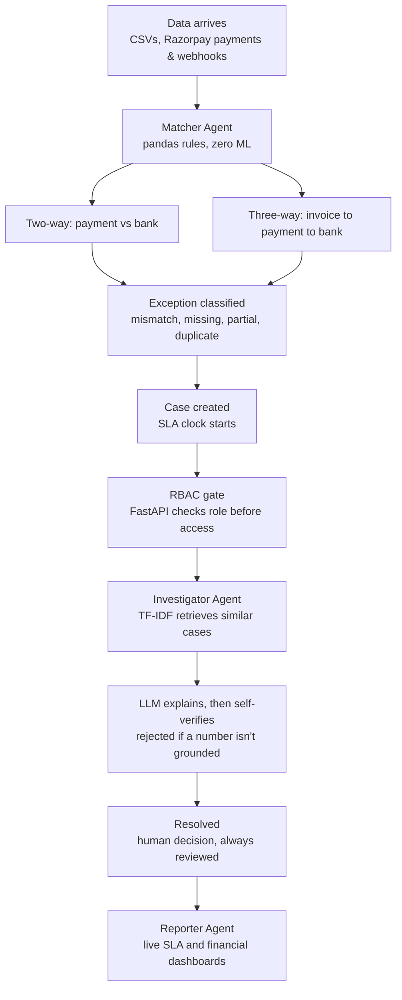
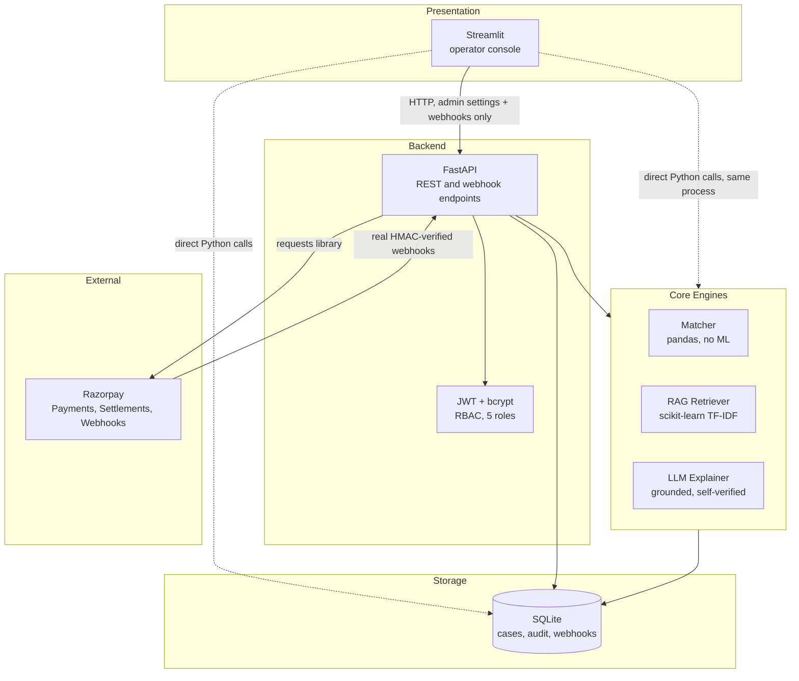

# AI Finance Controller

An end-to-end reconciliation and exception-management platform — built for
the Razorpay AI Buildathon, AI Finance Controller track.

Merchants reconcile payment ledgers against bank and settlement statements
by hand. Amounts drift, settlements delay, payments go missing on one side
or the other. Finding the mismatch is only step one — someone still has to
investigate why it happened, decide who owns it, track how urgent it is,
and prove it was handled. This system covers that whole lifecycle, not
just the matching step.

## What it actually does

```
Payments / Invoices / Bank data  (CSV upload, or live Razorpay API + webhooks)
        ↓
Deterministic matching — two-way and three-way, no LLM involved
        ↓
Every exception becomes a tracked case, not a spreadsheet row
        ↓
RAG-grounded AI explains the likely cause — verified before being shown
        ↓
Role-based case management: assign, investigate, resolve, audit
        ↓
SLA tracking and live financial dashboards
```

## Workflow



Clean matches never appear in this diagram on purpose — they're compared
and discarded at the Matcher stage. Only exceptions become cases and
continue through the rest of the flow. The Auditor agent isn't a box
here either, because it isn't a stage — it's a background process
writing an append-only record of every arrow shown above.

## System Architecture



Two things worth knowing about this diagram if you're reading the code
alongside it:

- **Streamlit talks to the database and matching engine directly**, not
  through the API, for everything except admin settings and the webhook
  endpoint. That's deliberate — a same-process console doesn't need an
  HTTP round-trip to itself. FastAPI exists as the *external* integration
  surface, for Razorpay and anything outside this app.
- **The dotted lines are in-process function calls; the solid lines are
  real network requests.** The distinction matters for understanding
  where RBAC is actually enforced — at the FastAPI layer, on every solid
  line into it.

## Agent Architecture — four agents, each with one job

1. **Matcher** — pure rule-based logic (pandas). Two-way matching (payment
   against bank) and three-way matching (invoice through payment through
   bank), catching amount mismatches, partial payments, duplicates, and
   missing records on either side. No LLM involved — deterministic and
   auditable, on purpose. A reconciliation decision needs to be a rule an
   auditor can verify, not a model's confidence score.
2. **Investigator / Explainer** — the only agent that calls an LLM, and
   only on exceptions the Matcher already flagged, never on clean matches.
   Two stages: TF-IDF (scikit-learn) retrieves similar historical cases
   first, with no LLM involved yet; then an LLM writes the explanation.
   Every number the LLM states is checked against the source record before
   being shown — an explanation citing a figure that isn't actually there
   is rejected, not displayed as fact. That's the hallucination guard.
3. **Auditor** — an append-only log of every action taken on every case:
   status changes, assignments, notes, investigations, resolutions, even
   denied access attempts. Nothing in this system ever edits or deletes
   that history.
4. **Reporter** — aggregates reconciliation results, financial exposure,
   and SLA performance into live dashboards. Every number is computed from
   the actual case data at request time — nothing cached, nothing
   hardcoded.

## Beyond the four agents

- **Role-based access control** — five roles (Admin, Finance Manager,
  Finance Analyst, Auditor, Viewer), enforced at the API layer itself, not
  just hidden in the UI. A request from a role without permission is
  rejected by the backend regardless of what the frontend shows.
- **SLA tracking** — severity-driven targets (4 hours for critical, up to
  a week for low), four live states (pending, at risk, met, breached),
  computed fresh from real timestamps every time.
- **Real Razorpay integration** — Payments and Settlements APIs, plus
  webhook handling with HMAC-SHA256 signature verification checked against
  the raw request bytes before any JSON is parsed. This was tested against
  a real Razorpay test-mode payment and a real webhook delivery from
  Razorpay's own servers — not simulated.

## Honest, measured accuracy

The matcher was validated three separate ways, not just against data we
built ourselves:

| Validation | What it proves |
|---|---|
| Synthetic dataset | Core matcher logic works correctly |
| **BenchRec** — independent, externally published benchmark | Matching generalizes beyond our own data |
| **Ground-truth set with deliberate hard negatives** | The matcher doesn't cry wolf on legitimate edge cases designed to look like failures |

One cherry-picked match proves nothing — these three sources exist so the
accuracy claim can actually be checked.

## Technology

Python throughout. **Streamlit** for the UI, **FastAPI** for the backend
API, **pandas** for matching, **scikit-learn** (TF-IDF) for retrieval, a
swappable **LLM** provider (Anthropic / Gemini / OpenAI) for explanation,
**SQLite** for storage, **PyJWT** + **bcrypt** for authentication, and the
**Razorpay API** with **HMAC-SHA256** for webhook security.

## Security notes

- Secrets are read from environment variables only — never hardcoded,
  never logged, never returned by any API response.
- Passwords are bcrypt-hashed; sessions are signed JWTs.
- Synthetic sample datasets contain no real payment data or PII.
- The LLM never sees the full case database — only one already-flagged
  exception record at a time, passed as clearly delimited data, never
  blended into system instructions.

## Setup

```bash
pip install -r requirements.txt
cp .env.example .env   # fill in your own values — never commit .env
```

Required in `.env` at minimum:
```
JWT_SECRET_KEY=<any long random string>
AUTH_ADMIN_EMAIL=<your admin email>
AUTH_ADMIN_PASSWORD=<your admin password>
```

Run both processes:
```bash
uvicorn case_management.api:app --reload --port 8001
streamlit run app.py
```

Live Razorpay integration (`RAZORPAY_KEY_ID`, `RAZORPAY_KEY_SECRET`) is
optional — the system runs fully in mock mode without it, including the
automated test suite, which never requires live credentials.

## What's honestly still manual or limited

- SQLite is the right choice at this scale, not at high-concurrency
  production scale — that migration hasn't been done.
- Live Razorpay calls and the LLM explainer both require your own real
  credentials; neither is called automatically by the test suite.
- `/v1/transactions` (RazorpayX payouts) requires RazorpayX business-
  banking access, separate from standard Payments access — the core
  Invoice-Payment-Settlement workflow doesn't need it.

## License

MIT
